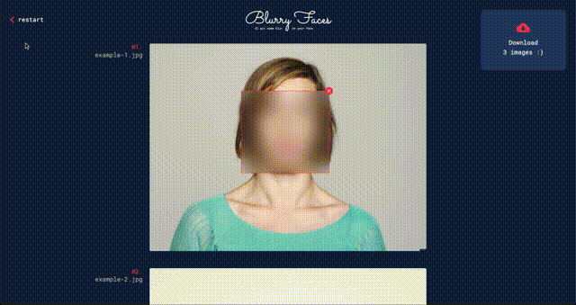

# Blurry faces

[Blurry faces website](https://willybrauner.github.io/blurry-faces)

Blurry Faces is a client-side application that automatically detects faces on images and blurs them.
It can then generate a zip file of the blurred images, and that's it!

## How to use?

1. Import your images in the app.
2. Inspect the result of the automated blurring and optionally adjust it.
3. Export the resulting collection of blurred images as a zip file.

## How does it work?

The app uses [face-api]("https://github.com/justadudewhohacks/face-api.js/") to detect faces on images,
it does not upload images to any server, it is a purely client-side face detection library. You can check the source code :)

## Licence

[MIT](./LICENSE)

## Credits

dev & design by [Willy Brauner](https://willybrauner.com)
