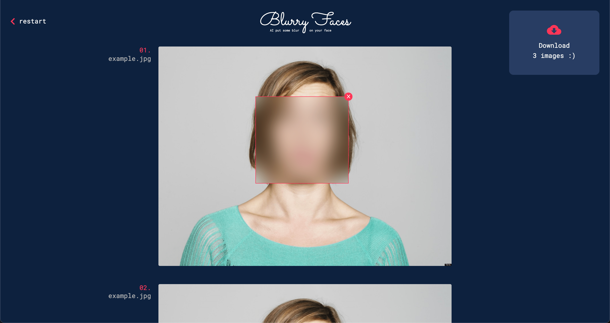

# Blurry faces

Blurry faces is a full client application able to make faces auto-detection on gallery images
and add blur area to them. A zip file can be download with the burry images collection, and that's it!

## How it works?

This app use [face-api]("https://github.com/justadudewhohacks/face-api.js/") for face detections coordinates on each images.
Your images are not saved anywhere, you can check the source code :)

## Credits

Willy Brauner
